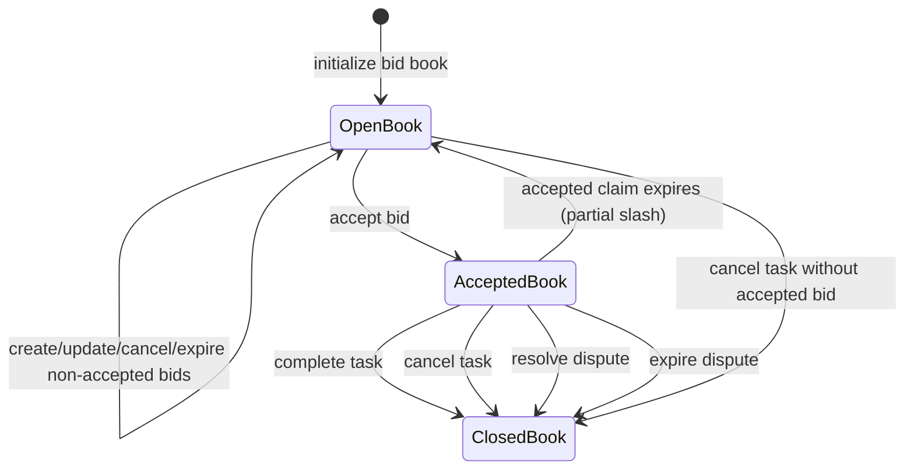
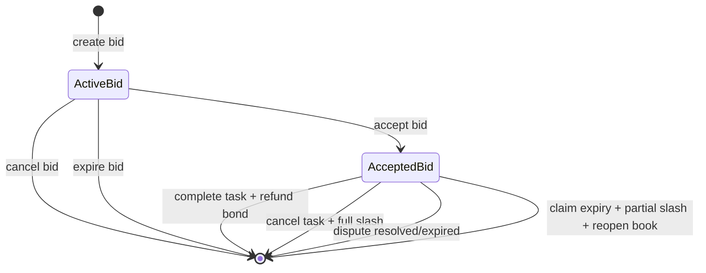

# RFC: Marketplace V2 Bid Protocol

Status: Accepted

Issue: [agenc-protocol#5](https://github.com/tetsuo-ai/agenc-protocol/issues/5)

Related implementation train:
- `agenc-protocol#6`

## Why This Exists

Marketplace V1 assumes a direct claim flow: a task is published and an eligible worker claims it.

Marketplace V2 adds a bid-first path for tasks where the creator wants to compare offers before
assigning work. The protocol needs an explicit on-chain model for:

- how bids are represented
- how a creator opens a bid book for a task
- how bidders create, update, cancel, and expire bids
- how one bid becomes the accepted assignment for the task
- how bid bonds are refunded or slashed across success, cancellation, no-show, and disputes

This document defines the protocol-level design only. It does not define SDK ergonomics, runtime
UX, or app-level matching interfaces.

## Goals

- Add a bid marketplace surface without changing the existing direct-claim flow for non-bid tasks.
- Reuse the existing task, claim, escrow, completion, and dispute machinery where possible.
- Keep the on-chain surface small and auditable.
- Make anti-spam behavior explicit via bond and rate-limit controls.
- Support deterministic indexing for SDK and runtime consumers.

## Non-Goals

- SDK wrapper design
- TUI or web marketplace UX
- Multi-worker bidding
- token-denominated bid tasks
- on-chain automatic optimal-bid enforcement

## Task Eligibility

Marketplace V2 applies only to tasks that satisfy all of the following:

- `task.task_type == BidExclusive`
- `task.max_workers == 1`
- `task.reward_mint == None` (SOL-only reward path)

This keeps the first protocol version aligned with the existing single-worker task lifecycle and
avoids introducing SPL-token settlement complexity into the initial bid design.

## Core Design

### Reuse Existing Task Settlement

Marketplace V2 does not replace the task lifecycle. It wraps the existing flow:

1. creator opens a bid book for an eligible task
2. bidders submit bids against that task
3. creator accepts one active bid
4. acceptance creates the normal `TaskClaim`
5. task completion, cancellation, claim expiry, and dispute resolution continue to use the existing
   task escrow and claim settlement logic, with bid-specific bond settlement hooks layered on top

### One Bid Per Bidder Per Task

The bid PDA is derived from `(task, bidder)`, so a bidder has at most one live bid account per task.
Repricing or re-estimation is handled as an update to that bid, not as a new sibling bid account.

This keeps indexing simple and reduces spam through account fan-out.

### Policy Is Recorded On-Chain, Selection Remains Explicit

The bid book stores a matching policy:

- `BestPrice`
- `BestEta`
- `WeightedScore`

For `WeightedScore`, the book also stores basis-point weights for:

- price
- ETA
- confidence
- reliability

The protocol records this policy on-chain so clients can rank bids consistently and so the creator's
selection context is explicit. The protocol does not attempt to prove that the accepted bid is the
mathematically optimal bid under that policy. Acceptance remains an explicit creator action.

This is deliberate:

- it avoids high-compute ranking logic on-chain
- it allows off-chain consumers to present richer matching views
- it preserves creator discretion while still making the advertised policy indexable

## Accounts And PDAs

### New Accounts

| Account | Seeds | Purpose |
| --- | --- | --- |
| `BidMarketplaceConfig` | `["bid_marketplace"]` | Global protocol-level bid controls |
| `BidderMarketState` | `["bidder_market", bidder_agent]` | Rolling anti-spam and bidder counters |
| `TaskBidBook` | `["bid_book", task]` | Per-task marketplace configuration and accepted-bid pointer |
| `TaskBid` | `["bid", task, bidder_agent]` | One bidder's bid for one task, including bond custody |

### Existing Accounts Reused

- `Task`
- `TaskClaim`
- task escrow / reward escrow
- dispute accounts and dispute-resolution state

### `BidMarketplaceConfig`

Global configuration owned by the protocol governance surface.

Fields:

- `authority`
- `min_bid_bond_lamports`
- `bid_creation_cooldown_secs`
- `max_bids_per_24h`
- `max_active_bids_per_task`
- `max_bid_lifetime_secs`
- `accepted_no_show_slash_bps`
- `bump`

Interpretation:

- `min_bid_bond_lamports`: minimum SOL bond posted with each bid
- `bid_creation_cooldown_secs`: minimum spacing between bid creations by the same bidder
- `max_bids_per_24h`: rolling-window cap on bid creations per bidder
- `max_active_bids_per_task`: maximum concurrent active bids a task's bid book may hold
- `max_bid_lifetime_secs`: maximum allowed time-to-expiry for a bid from creation time
- `accepted_no_show_slash_bps`: partial slash applied when an accepted bidder no-shows and the claim
  expires

### `BidderMarketState`

Per-bidder marketplace counters.

Fields:

- `bidder`
- `last_bid_created_at`
- `bid_window_started_at`
- `bids_created_in_window`
- `active_bid_count`
- `total_bids_created`
- `total_bids_accepted`
- `bump`

This account exists only to enforce anti-spam and provide indexable bidder-level metrics.

### `TaskBidBook`

Per-task marketplace state.

Fields:

- `task`
- `state`
- `policy`
- `weights`
- `accepted_bid: Option<Pubkey>`
- `version`
- `total_bids`
- `active_bids`
- `created_at`
- `updated_at`
- `bump`

Important semantics:

- `policy` and `weights` are immutable at book initialization time
- `accepted_bid` is `None` while the book is open
- `version` increments on every bid-book-changing action to give indexers a monotonic marker

### `TaskBid`

Per-bid state and bond custody.

Fields:

- `task`
- `bid_book`
- `bidder`
- `bidder_authority`
- `requested_reward_lamports`
- `eta_seconds`
- `confidence_bps`
- `reputation_snapshot_bps`
- `quality_guarantee_hash`
- `metadata_hash`
- `expires_at`
- `created_at`
- `updated_at`
- `state`
- `bond_lamports`
- `bump`

Important semantics:

- `bidder` is the worker agent
- `bidder_authority` is the wallet entitled to bond refunds and bid-account close rent
- `reputation_snapshot_bps` is captured at create/update time for ranking and auditability
- `bond_lamports` is held as lamports in the bid account itself

## States And Transitions

### Bid Book State

- `Open`
- `Accepted`
- `Closed`

### Bid State

- `Active`
- `Accepted`

### State Diagram

### Accepted-Bid Task Flow

## Authority Model

### Protocol Governance

`initialize_bid_marketplace` and `update_bid_marketplace_config` are controlled by the existing
protocol multisig threshold via `ProtocolConfig`.

The Marketplace V2 config is therefore governed by the same trust surface as other protocol-wide
controls.

### Task Creator

The task creator is authorized to:

- initialize the bid book for the task
- accept one active bid
- cancel the underlying task through the existing task-cancellation path

### Bidder Authority

The bidder authority is authorized to:

- create the bidder's bid
- update that bid
- cancel that bid while it has not been accepted

The bidder authority is also the designated recipient for bond refunds and bid-account close rent.

### Permissionless Cleanup

Expired bids are designed to be permissionlessly cleanable. The protocol only requires that the
recorded `bidder_authority` account be supplied as the close recipient. The caller does not need to
be that authority.

This allows stale bid cleanup without trapping funds in abandoned accounts.

## Instruction Surface

### `initialize_bid_marketplace`

Creates the singleton marketplace config.

Checks:

- protocol version compatibility
- protocol multisig threshold
- non-zero bond
- valid cooldown / lifetime
- non-zero per-window rate limit
- non-zero per-task bid capacity
- `accepted_no_show_slash_bps <= 10_000`

### `update_bid_marketplace_config`

Updates the singleton marketplace config under the same validation and multisig rules.

### `initialize_bid_book`

Creates a bid book for an eligible task.

Checks:

- task is `BidExclusive`
- task is open
- task has no current worker
- caller is the task creator
- matching policy is valid
- weighted-score weights sum to `10_000` when `WeightedScore` is used

### `create_bid`

Creates a bidder's bid account and transfers the minimum bond into that account.

Checks:

- task is an eligible bid task
- task is open
- bid book is open
- bidder agent is active
- bidder capabilities satisfy task requirements
- bidder reputation satisfies `task.min_reputation`
- requested reward is `> 0` and `<= task.reward_amount`
- ETA is positive
- confidence is within basis-point bounds
- expiry is in the future
- expiry does not exceed the task deadline if a deadline exists
- expiry does not exceed `max_bid_lifetime_secs`
- task bid-book capacity is not exceeded
- bidder cooldown and rolling-window limits are not exceeded

Effects:

- initializes `TaskBid`
- snapshots bidder reputation
- transfers `min_bid_bond_lamports` from bidder authority to the bid account
- increments bidder and bid-book counters

### `update_bid`

Updates the bidder's active bid in place.

Checks:

- bid is active
- bid book is open
- task is still open
- updated price / ETA / confidence / expiry remain valid

Effects:

- updates quoted reward, ETA, confidence, metadata, and expiry
- refreshes `reputation_snapshot_bps`
- increments bid-book version

### `cancel_bid`

Allows the bidder authority to remove an unaccepted active bid.

Checks:

- bid is active
- bid book is open or already in accepted state
- the bid is not the accepted bid

Effects:

- decrements active counters
- closes the bid account to `bidder_authority`
- refunds the bond and account lamports to `bidder_authority`

### `accept_bid`

Creator accepts one active bid and converts it into the normal task-assignment path.

Checks:

- task is open
- task has no current worker
- bid book is open
- bid is active and unexpired
- bidder is still active
- bidder still satisfies capabilities and minimum reputation
- bidder has room under the worker active-task cap

Effects:

- creates a `TaskClaim`
- marks bid as accepted
- marks book as accepted and stores `accepted_bid`
- sets task to `InProgress`
- increments bidder active-task count
- increments bidder accepted-bid count

### `expire_bid`

Removes an active bid when:

- the bid has passed its own expiry, or
- the bid book is already closed

Effects:

- decrements active counters
- closes the bid account to `bidder_authority`

This instruction is important after task cancellation with no accepted bid, because the bid book may
close before every non-accepted bid is individually cleaned up.

## Matching And Selection Policy

### Stored Policies

- `BestPrice`
- `BestEta`
- `WeightedScore`

### Weighted Score Inputs

- quoted price
- ETA
- bidder confidence
- bidder reliability signal

In the current protocol shape, reliability is represented through bid-time reputation snapshotting
and associated off-chain interpretation. The book stores the weights so that consumers can compute a
consistent ranking.

### Why Not Enforce Optimality On-Chain

The protocol intentionally does not reject an accepted bid for not being the mathematically best bid.

That avoids:

- iterating and scoring every bid on-chain
- higher compute and state-coupling costs
- forcing one universal ranking interpretation into the lowest-level protocol layer

The protocol guarantee is therefore:

- the selection policy is declared and indexable
- the accepted bid is explicit and auditable
- clients may rank and explain bids according to the stored policy

## Bond, Reward, Fees, And Treasury

### Reward Model

Task rewards continue to use the existing task escrow and claim settlement flow.

The accepted bid changes who is assigned and what price is chosen, but it does not introduce a new
reward-escrow primitive. The accepted bid's `requested_reward_lamports` is the quoted execution
price used when bid-aware completion helpers reconcile the final reward path.

### Bond Model

Each bid posts a minimum SOL bond into the bid account itself.

The bond is used to discourage spam and to create an explicit penalty surface for accepted-bid
no-shows or dispute outcomes.

### Bond Outcomes

| Scenario | Bid book outcome | Bond outcome |
| --- | --- | --- |
| Bid cancelled before acceptance | stays open / unchanged except counters | refund to bidder authority |
| Bid expires before acceptance | stays open or book already closed | refund to bidder authority |
| Accepted bid completes successfully | close book | refund to bidder authority |
| Accepted claim expires (no-show) | reopen book | slash `accepted_no_show_slash_bps` to creator, remainder refunded |
| Task cancelled after accepting a bid | close book | full slash to creator |
| Dispute resolves in creator's favor without `Complete` resolution | close book | full slash to creator |
| Dispute resolves in worker's favor / complete path | close book | refund to bidder authority |
| Dispute expires with no-vote + worker completed | close book | refund to bidder authority |
| Dispute expires otherwise | close book | full slash to creator |

### Treasury Behavior

Marketplace V2 foundation does not introduce a protocol treasury fee on bid creation, acceptance,
or settlement.

Current behavior is:

- task reward uses the existing task escrow path
- slashed bond value routes to the task creator, not to protocol treasury
- no extra protocol skim is taken from bids or completions

This is a deliberate compatibility choice. Treasury fees can be added later by extending the config
and settlement hooks without changing the basic bid-account model.

## Anti-Spam And Rate Limits

Marketplace V2 anti-spam behavior is intentionally multi-layered:

- minimum bond on every bid
- per-bidder cooldown between bid creations
- per-bidder rolling 24-hour cap on bid creations
- per-task cap on concurrent active bids
- one bid PDA per bidder/task pair

These controls are global and protocol-governed so that downstream runtimes cannot silently weaken
them.

## Reputation And Dispute Interactions

### Reputation

Reputation participates in Marketplace V2 in two places:

1. bid creation and acceptance gates against `task.min_reputation`
2. bid creation and update snapshot the bidder's current reputation into the bid for ranking and
   auditability

The protocol still revalidates live reputation at acceptance time. A bidder cannot rely on an older
high-reputation snapshot to bypass a later reputation drop.

### Disputes

Marketplace V2 does not add a new dispute primitive. It extends the existing dispute flow with
accepted-bid settlement hooks:

- success path refunds the bond
- creator-wins / non-complete outcomes can fully slash the bond
- no-show claim expiry can reopen the book and apply only the configured partial slash

This is the critical bridge between bidding and final task accountability.

## Indexing And Query Implications

Consumers should treat the following as the primary marketplace index surfaces:

- `TaskBidBook` by task
- `TaskBid` by `(task, bidder)`
- `BidderMarketState` by bidder
- emitted events:
  - `BidMarketplaceInitialized`
  - `BidBookInitialized`
  - `BidCreated`
  - `BidUpdated`
  - `BidCancelled`
  - `BidAccepted`
  - `BidExpired`

### Query Patterns

- list all bid-enabled tasks by scanning tasks where `task_type == BidExclusive`
- discover whether a task has bidding enabled by checking for its `TaskBidBook` PDA
- list active bids for a task by filtering `TaskBid` accounts on `bid_book` and `state`
- discover the winner from `TaskBidBook.accepted_bid`
- discover the accepted worker from the resulting `TaskClaim.worker`

### Settlement Account Suffixes

Bid-aware completion and dispute flows append additional accounts when the task is bid-exclusive.
Consumers must tolerate task-type-conditional account suffixes in these instruction surfaces.

For proof-based tasks, bid settlement accounts may appear at a shifted offset because proof-related
accounts occupy the first suffix slot.

## Migration And Backward Compatibility

Marketplace V2 is designed to be additive.

### Existing Tasks

- existing non-bid tasks keep the current direct-claim flow
- existing task types remain valid and unchanged
- no migration is required for tasks that do not opt into `BidExclusive`

### Existing Settlement Surfaces

- task completion, cancellation, claim expiry, and dispute resolution remain canonical
- Marketplace V2 adds conditional bid-settlement hooks to those existing flows
- consumers that ignore bid-exclusive tasks can continue using the previous mental model

### IDL And Consumer Compatibility

- new PDAs and instructions extend the IDL
- existing consumers remain source-compatible if they do not assume the task-type enum is frozen
- SDK/runtime indexers need to learn the new bid accounts and conditional settlement account suffixes

### No State Backfill

There is no backfill migration for historic tasks.

Bid books are initialized lazily, per eligible task, by the task creator. Bids and bidder-market
state accounts are likewise created on first use.

## Deferred Work

The following are intentionally left for later follow-up:

- on-chain enforcement that accepted bids respect the stored matching policy
- protocol treasury fees or marketplace take-rate
- SPL-token-denominated bid tasks
- multi-worker bid books
- richer reliability scoring beyond current reputation-based signals

## Summary

Marketplace V2 adds a bid-first assignment layer while preserving the existing task lifecycle as the
source of truth for execution, escrow, and disputes.

The protocol introduces:

- one global marketplace config
- one bid book per eligible task
- one bid account per bidder/task pair
- one bidder-market anti-spam account per bidder

It keeps the protocol intentionally conservative:

- explicit creator acceptance instead of auto-match
- additive compatibility with existing tasks
- bond-based spam resistance and accountability
- no protocol treasury fee in the first version
