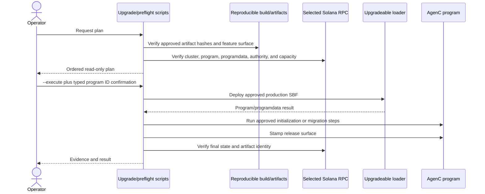

# Build and deployment

## Toolchain and workspace

The JavaScript workspace requires Node `>=22.23.1` and pins npm `11.18.0`. The Rust toolchain file selects Rust `1.85.0`; CI separately verifies the declared minimum supported Rust version, `1.82`. Anchor and Solana versions are pinned in `Anchor.toml` to Anchor `0.32.1` and Solana `3.0.13`.

The root npm package is private and coordinates nine workspaces. Root `build`, `typecheck`, and `pack` scripts cover the protocol package directly; package-specific and CI scripts deliberately build the broader graph in dependency order. A root command alone should not be mistaken for a complete monorepo release build.

The Anchor program defaults to the `spl-token-rewards` feature. `mainnet-canary` selects a reduced program surface, and `private-zk` selects quarantined private-proof code. Compile-time guards reject unsupported combinations and bare surfaces.

## Artifact lineage

```mermaid
flowchart LR
    Rust[Rust program source] --> Anchor[anchor build]
    Anchor --> Target[target/idl and target/types]
    Target --> SyncA[sync-anchor-artifacts]
    SyncA --> Canonical[artifacts/anchor]
    Canonical --> Manifest[artifact manifest and hashes]
    Canonical --> SyncP[sync-package-protocol-assets]
    SyncP --> ProtocolGen[packages/protocol/src/generated]
    Canonical --> Codama[SDK generation]
    Codama --> SDKGen[packages/sdk-ts/src/generated]
    ProtocolGen --> ProtocolPkg[@tetsuo-ai/protocol package]
    SDKGen --> SDKPkg[@tetsuo-ai/marketplace-sdk package]
    ProtocolPkg --> SDKPkg
```

`target/` is a build workspace. `artifacts/anchor/` is the checked-in canonical handoff, and package-generated files are downstream copies/derivations. CI rebuilds and compares these layers to catch drift. At the analyzed commit the manifest binds program ID `HJsZ53Zb27b8QMRbQpuDngE44AdwCGxvEZr61Zmxw1xK` and records hashes for the canonical IDL and generated Rust/TypeScript contract artifacts.

Generated SDK and protocol files carry generated status and must be refreshed through their generators, not edited as handwritten source. The ignored TypeDoc tree under `packages/sdk-ts/docs/api` is also derived output and is not part of the tracked documentation contract.

## Package build graph

| Order | Package | Build notes |
|---|---|---|
| 1 | protocol | Packages canonical IDL/types/schema/manifest/verifier contract |
| 2 | SDK and moderation | SDK consumes protocol contracts; moderation has release-order coupling |
| 3 | React, tools, worker | Consume SDK; React emits multiple entries and CSS |
| 4 | MCP | Consumes SDK and marketplace tools |
| 5 | CLI | Consumes SDK and worker |
| 6 | compatibility alias | Delegates to scoped CLI |

Package builds emit ESM, CommonJS, and declarations. Dependencies and peers are externalized according to package policy. Pack-smoke tests install tarballs into isolated fixtures and dynamically import the built outputs to verify published, rather than source-tree, behavior.

## Development and localnet

`localnet-up` starts a validator with the program loaded through the upgradeable loader at genesis, reserves ports, records process identity, and can wait for a `--dev-ready` condition. It writes a bound environment description under `.localnet/env.json`. Locks and process fingerprints prevent unrelated processes from being treated as the managed validator.

`localnet-status` verifies the validator identity and checks program, programdata, and configuration bindings. `localnet-down` validates process identity before signaling or purging managed state. The CLI development workflow layers project templates and SDK sandbox/testing helpers over these rails.

Integration tests use compiled program artifacts and either validator or LiteSVM-style environments as selected by the test. Optional `litesvm` is dynamically loaded only by the testing subpath, so consumers that do not use it do not acquire that runtime requirement.

## CI verification matrix

| Workflow area | Gates |
|---|---|
| General CI | npm audits, script regressions, Rust format/clippy/tests, fuzz checks, artifact checks, protocol build/typecheck/pack |
| Program features | default, validation variants, private-ZK, and canary compilation/test surfaces |
| Compatibility | Node floor and Rust MSRV |
| IDL drift | fresh Anchor build, stack checks, canonical artifact comparison, canary IDL/baseline checks |
| Coverage | `cargo llvm-cov` output checked against the committed percentage ratchet |
| SDK/downstreams | generated clients, compiled-program integrations, package build and dependent-package checks |
| React fixtures | application fixtures and Playwright browser tests |
| Supply chain | dependency policy, CodeQL, secret scanning, Rust advisory/licensing checks |
| Reproducibility | independent canary and production SBF builds and hash comparison |
| Release | complete package/program gates, SBOM, tarball staging, provenance, npm dist-tags, GitHub release assets |

The exact workflow and script inventory is linked from [source-inventory.md](source-inventory.md#build-policy-contract-and-configuration-files).

## Mainnet upgrade flow



Mainnet rails are plan-only unless `--execute` is supplied with the required typed confirmations. They bind the intended program ID, selected RPC/cluster, upgradeable-loader accounts, approved hashes, buffer/programdata capacity, and ordered actions. The upgrade path does not automatically extend accounts and rejects the private-ZK feature for production. Initialization, stamping, migration, and fee/config operations have their own plan/execute boundaries.

This repository-level safety does not authorize a deployment by itself. Key custody, multisig/change approval, the selected live cluster, fees, and organizational release policy remain external operator responsibilities.

## npm and repository release

Release scripts validate a dependency-aware package train, version consistency, packed contents, generated artifacts, security/compatibility gates, and program artifacts. Packages are staged before distribution tags are advanced, reducing the chance that dependents point at unavailable internal versions. Release workflows also create SBOM/provenance and GitHub release assets.

Tags route the release workflow, but the exact release target is validated from package metadata rather than inferred only from a tag string. Installer-only or documentation changes should not rebuild unchanged consensus binaries unless the release procedure explicitly requires it.

## Rollback and recovery considerations

The source contains migration and exit-compatible instructions but no universal binary rollback primitive. A Solana upgrade rollback is another governed upgrade and must remain compatible with already migrated account versions. Before an upgrade, retain the previous verified SBF/IDL, artifact hashes, programdata capacity evidence, configuration snapshots, and an instruction-level recovery plan. Local worker and orchestration checkpoints are operational recovery mechanisms and do not roll back on-chain transactions.
