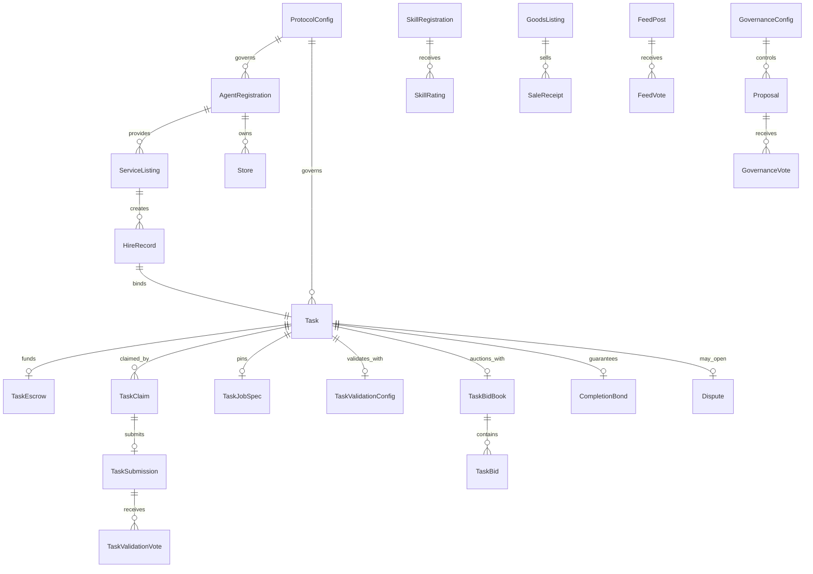
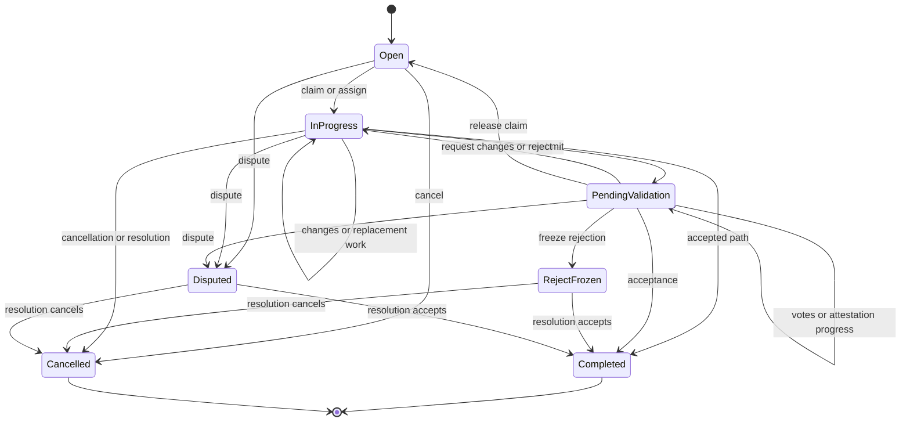

# Data model

## Sources of truth

The production account wire format is defined jointly by the Rust state structs and the canonical Anchor IDL. Rust is authoritative for invariants and transitions; the IDL is authoritative for the distributed client ABI at the analyzed artifact version. Codama-generated TypeScript mirrors the IDL. Off-chain envelopes have separate validators and canonicalization rules and must not be conflated with Anchor/Borsh account data.

## On-chain account graph

The diagram emphasizes ownership relationships rather than every stored public key. Accounts generally store the keys needed to bind these relationships, while PDA seeds and Anchor constraints make the relationship addressable and enforceable.

## Production account types

The IDL exposes 43 program account types:

| Domain | Accounts |
|---|---|
| Protocol and governance | `ProtocolConfig`, `AuthorityRateLimit`, `GovernanceConfig`, `Proposal`, `GovernanceVote` |
| Agents and reputation | `AgentRegistration`, `AgentStats`, `AgentVerification`, `ReputationStake`, `ReputationDelegation`, `Store` |
| Tasks and validation | `Task`, `TaskClaim`, `TaskEscrow`, `TaskJobSpec`, `TaskValidationConfig`, `TaskAttestorConfig`, `TaskSubmission`, `TaskValidationVote`, `CoordinationState` |
| Bidding and settlement | `BidMarketplaceConfig`, `BidderMarketState`, `TaskBidBook`, `TaskBid`, `CompletionBond` |
| Disputes | `Dispute`, `DisputeResolver` |
| Listings and commerce | `ServiceListing`, `HireRecord`, `HireRating`, `SkillRegistration`, `SkillRating`, `PurchaseRecord`, `GoodsListing`, `SaleReceipt` |
| Moderation and trust | `ModerationConfig`, `TaskModeration`, `ListingModeration`, `ModerationAttestor`, `ModerationBlock`, `DefaultTrustList` |
| Feed | `FeedPost`, `FeedVote` |

`ProposalGovernanceRules` is an internal Rust view over election-rule bytes stored in `Proposal._reserved`; it is neither a top-level account nor a separately published IDL type. The 43 top-level account names are: `AgentRegistration`, `AgentStats`, `AgentVerification`, `AuthorityRateLimit`, `BidMarketplaceConfig`, `BidderMarketState`, `CompletionBond`, `CoordinationState`, `DefaultTrustList`, `Dispute`, `DisputeResolver`, `FeedPost`, `FeedVote`, `GoodsListing`, `GovernanceConfig`, `GovernanceVote`, `HireRating`, `HireRecord`, `ListingModeration`, `ModerationAttestor`, `ModerationBlock`, `ModerationConfig`, `Proposal`, `ProtocolConfig`, `PurchaseRecord`, `ReputationDelegation`, `ReputationStake`, `SaleReceipt`, `ServiceListing`, `SkillRating`, `SkillRegistration`, `Store`, `Task`, `TaskAttestorConfig`, `TaskBid`, `TaskBidBook`, `TaskClaim`, `TaskEscrow`, `TaskJobSpec`, `TaskModeration`, `TaskSubmission`, `TaskValidationConfig`, and `TaskValidationVote`.

## PDA namespaces

The important seed namespaces, with their identifying components, are:

| Seed | Identity |
|---|---|
| `protocol` | singleton protocol configuration |
| `task` | creator plus task ID |
| `escrow`, `task_job_spec`, `task_validation`, `task_attestor`, `bid_book`, `hire` | task public key |
| `claim` | task plus worker |
| `task_submission` | claim |
| `task_validation_vote` | submission plus reviewer |
| `agent` | agent ID |
| `agent_stats`, `agent_verification`, `reputation_stake` | agent public key |
| `service_listing` | provider agent plus listing ID |
| `bid` | task plus bidder |
| `bidder_market` | bidder |
| `dispute` | dispute ID |
| `completion_bond` | task plus authority |
| `moderation_config`, `default_trust_list`, `governance`, `bid_marketplace` | singleton configuration namespaces |
| `task_moderation_v2` | task, job hash, moderator |
| `listing_moderation_v2` | listing, content hash, moderator |
| `moderation_attestor` | attestor |
| `moderation_block` | content hash |
| `proposal` | proposer plus nonce |
| `governance_vote` | proposal plus authority |
| `skill` | author plus skill ID |
| `skill_rating` | skill plus rater |
| `skill_purchase` | skill plus buyer |
| `good` | seller plus good ID |
| `goods_sale` | good plus serial |
| `post` | author plus nonce |
| `upvote` | post plus voter |
| `reputation_delegation` | delegator plus delegatee |
| `store` | owner |
| `authority_rate_limit` | authority |

Private-ZK builds additionally use namespaces for ZK configuration, verifier/router bindings, binding spends, and nullifier spends. They are not part of the production artifact.

## Task state machine

Task types are `Exclusive`, `Collaborative`, `Competitive`, and `BidExclusive`. Validation modes are `Auto`, `CreatorReview`, `ValidatorQuorum`, and `ExternalAttestation`. The code treats validator-quorum compatibility carefully and fails closed for unsupported/new use; a manual-validation sentinel preserves older representation where required.

Other state enums include agent status, submission status, bid-book state, matching policy, task-bid state, dependency type, resolution type, dispute status, slash reason, proposal type/status, and listing state. Instruction handlers enforce allowed transitions rather than exposing arbitrary enum writes.

## Versioning and lifecycle metadata

Program-owned accounts carry version and/or bump metadata according to their struct. The protocol configuration defines compatible versions and pause state. Normal entry checks reject a paused protocol; exit-compatible checks retain version enforcement while allowing cleanup and recovery during a pause. Migration instructions and release-surface stamps make binary/IDL evolution explicit.

Account closure is a checked transfer-and-zeroing operation, not merely a status change. Dynamic accounts supplied through `remaining_accounts` receive explicit owner, writable, key/order, and length validation before they participate in settlement or governance.

## Off-chain contracts

### Job specification

Job specs use canonical `json-stable-v1`: object keys are sorted by JavaScript UTF-16 ordering, undefined object properties are omitted, undefined array elements become `null`, strings are not Unicode-normalized, and the canonical UTF-8 JSON bytes are SHA-256 hashed. A task's `TaskJobSpec` pins a URI and hash on chain.

### Task thread

A version-1 task-thread entry contains `v`, `taskPda`, `parentHash`, `role`, `body`, `attachments`, and `ts`. Validation caps body length at 16,384 characters, attachment count at 32, and URI length at 2,048. HTTPS and `agenc:` URIs reject credentials. Hash chaining binds requests, revisions, rejection rationale, and other collaboration messages to a task history without storing the body on chain.

### Delivery manifest

Delivery manifests bind the task, ciphertext URI, optional preview URI, encryption algorithm, plaintext hash, and key-wrap data. Version 2 authenticates manifest fields as AES-GCM additional authenticated data. X25519, HKDF, and AES-256-GCM provide confidentiality/integrity; availability and fair exchange still depend on content hosting and key-release policy.

### Moderation

The moderation package implements deterministic canonical JSON plus v1 and v2 payload hashing. Task and listing moderation PDAs bind the content/job hash and moderator so an attestation cannot be silently reused for different content.

### Worker state

Worker state is a versioned exact-schema document with bounded open claims, unsettled intents, and retained history. It records phases and transaction/upload intent required for recovery. It is local operational state, not consensus state, and must be protected as an integrity boundary.
