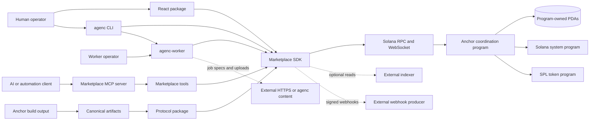

# Repository overview

## Executive summary

AgenC is a Solana marketplace protocol plus its client, automation, and operator surfaces. The trust-minimized core is the Anchor program in `programs/agenc-coordination`; TypeScript packages expose its generated ABI and higher-level workflows; the worker automates claim/execute/submit behavior; the MCP server exposes read and unsigned transaction-preparation tools; React and CLI packages provide human-facing integration; scripts and GitHub workflows build, verify, release, and deploy the system.

This repository is not a production HTTP service. GitNexus found three HTTP handlers, all fixture routes in `packages/sdk-ts/tests/task-thread.test.ts`. Production ingress is instead the Solana program ABI, npm package exports, the `agenc` and `agenc-worker` CLIs, the stdio MCP protocol, React hooks/components, and operator scripts. Optional indexer, moderation, content-addressed storage, RPC, and upload services are external systems represented here by clients or contracts, not server implementations.

## Repository shape

At the analyzed commit, Git tracked 1,273 files. The main source populations are 117 program files, 76 handwritten SDK files plus 328 generated SDK files, 68 handwritten React files, 14 CLI files, 12 worker files, 10 marketplace-tool files, 6 MCP files, one moderation source file, 121 scripts, 60 integration-test files, 10 fuzz targets, and 11 GitHub workflows. Exact path accounting is in [source-inventory.md](source-inventory.md).

GitNexus indexed 4,081 file nodes, 38,897 symbols, 68,940 relationships, and 300 process traces at commit `1765a2e`. Its file population differs from Git because it includes 3,238 ignored TypeDoc pages under `packages/sdk-ts/docs/api` while omitting Codama-generated SDK sources and some unsupported or generated files. This is why repository coverage is based on `git ls-files`, not graph file counts.

## Primary entry points

| Surface | Source entry | Runtime role |
|---|---|---|
| Solana program | `programs/agenc-coordination/src/lib.rs` | Two compile-time Anchor program surfaces: full production and `mainnet-canary` |
| SDK | `packages/sdk-ts/src/index.ts` | Generated instructions/accounts plus clients, queries, orchestration, delivery, events, and watch APIs |
| React | `packages/marketplace-react/src/index.ts` and subpath barrels | Hooks, components, signer bridges, and query integration |
| CLI | `packages/agenc-cli/src/bin.ts` → `runCli` | `init`, `dev`, and `promote` workflows |
| Worker | `packages/agenc-worker/src/cli.ts` | `up`, `once`, and `status`; durable autonomous execution |
| MCP | `packages/marketplace-mcp/src/bin.ts` | Stdio MCP server; read-only by default and unsigned mutation preparation when enabled |
| Tool adapters | `packages/marketplace-tools/src/index.ts` | Core tool registry plus OpenAI, LangChain, CrewAI, and agent-card adapters |
| Moderation | `packages/marketplace-moderation/src/index.ts` | Canonical JSON and moderation payload hashing |
| Operations | `scripts/*.mjs` | Artifact sync, localnet, compatibility, release, and guarded mainnet operations |

## Architectural layers

1. **On-chain state machine.** Anchor instructions own marketplace state transitions, PDA constraints, escrow, bids, validation, disputes, moderation, reputation, governance, listings, purchases, and settlement.
2. **Contract distribution.** `artifacts/anchor` is the repository artifact boundary. `@tetsuo-ai/protocol` publishes the IDL, generated types, daemon schema, manifest, and verifier-router contract.
3. **Client and workflow layer.** The SDK resolves transports and signers, builds versioned transactions, exposes account/event/query APIs, and composes higher-level hire and task workflows.
4. **Integration surfaces.** React, marketplace tools, MCP, CLI, and the worker reuse SDK behavior rather than reimplementing program encoding.
5. **Operational governance.** Scripts and workflows enforce version floors, IDL/artifact drift, coverage, feature surfaces, reproducibility, package release ordering, and guarded upgrades.

## Compile-time program surfaces

The default program build exposes the full 101-instruction production IDL committed at `artifacts/anchor/idl/agenc_coordination.json`. The `mainnet-canary` feature selects a deliberately smaller 25-instruction surface whose names and wire shapes are checked against `scripts/canary-idl-baseline.json`. The `private-zk` surface is quarantined from production release and cannot be combined with the canary feature. These are compile-time alternatives, not runtime routers.

## Structural findings from GitNexus

The largest heuristic clusters were scripts, instructions, integration tests, tests, facades, hooks, components, fuzz targets, clients, indexer code, orchestration, signers, server code, sandbox code, queries, tools, and watchers. These labels are useful navigation hints but are not module boundaries: GitNexus reported 66 aggregate labels while its lower-level community graph contained many repeated labels.

The graph contains 12,053 import edges, 9,791 call edges, 3,898 access edges, and 1,209 process-step edges. Its cycle check was clean. No graph-native entry-point relationships were present, and the route and tool detectors were incomplete; both findings were corrected through source inspection. See [coverage-report.md](coverage-report.md) for limitations.

## Ownership boundaries

The repository owns program logic, contracts, clients, UI integration, worker behavior, and operational rails. It does not contain the Solana validator/RPC implementation, the hosted indexer service, a hosted moderation service, arbitrary HTTPS content hosts, wallet implementations, external executor binaries, npm/GitHub infrastructure, or an upgrade-authority governance service. Those systems remain explicit trust and availability dependencies.
