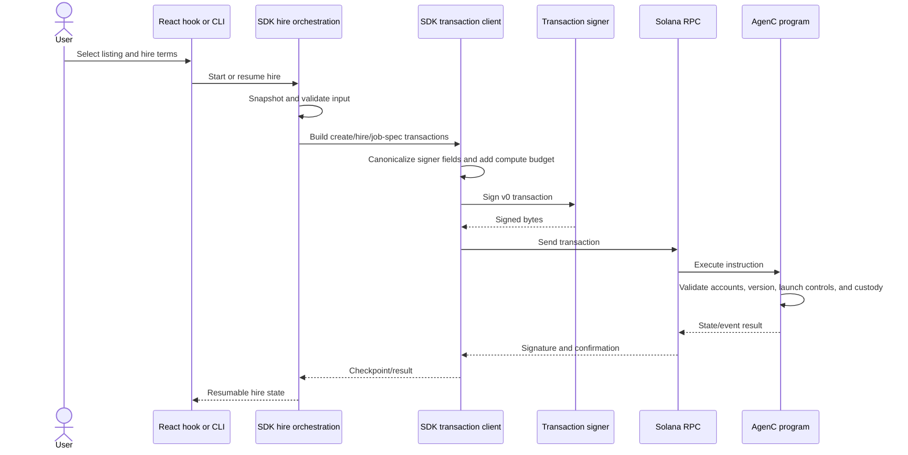
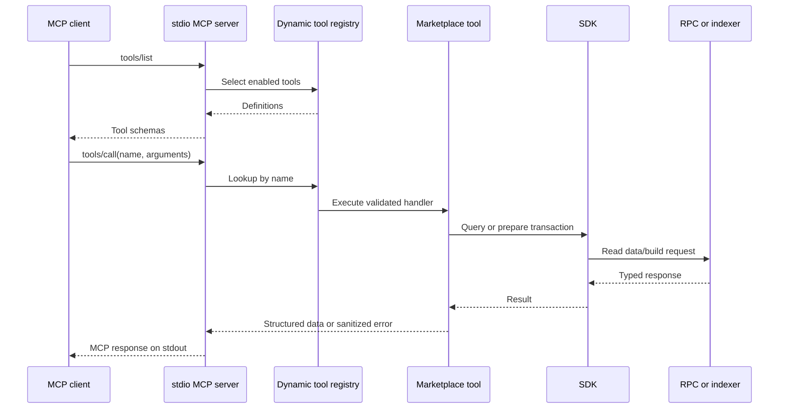
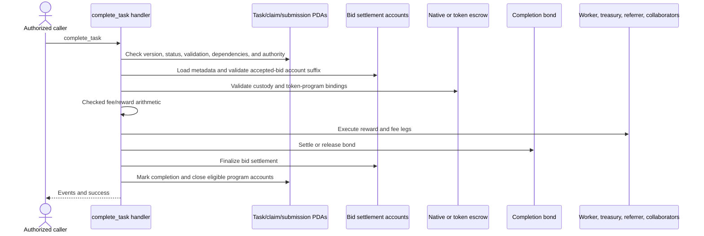

# Runtime flows

The flows below combine GitNexus process/call traces with direct verification of each participating implementation. A graph edge alone is not treated as evidence when Anchor macros, callbacks, generic transports, or dynamic registries obscure dispatch.

## Hire and activation



The facade locks transaction signers to their declared addresses before encoding. The client assembles versioned transactions, enforces the 1,232-byte serialized limit, and validates custom transport results. A transaction is re-signed only for a branded, proven pre-broadcast `BlockhashNotFound`; ambiguous post-broadcast errors retain the locally derived signature and are reconciled rather than blindly retried.

Humanless hire is a separate program instruction and SDK orchestration path. It preserves the same custody and signer boundary while allowing the client workflow to advance without an interactive creator review step where the selected validation mode permits it.

## Worker claim, execute, and submit

```mermaid
sequenceDiagram
    participant Loop as Worker tick loop
    participant State as Locked state/WAL
    participant SDK as SDK watcher/client
    participant Host as HTTPS or agenc resolver
    participant Exec as External executor
    participant Upload as Artifact uploader
    participant Chain as Solana program

    Loop->>State: Acquire lock and load exact-version state
    alt Open claim exists
        Loop->>State: Resume durable phase
    else Discover work
        Loop->>SDK: Watch/list directly claimable pinned tasks
        SDK-->>Loop: Candidate
    end
    Loop->>Host: Resolve, fetch, and size-limit job spec
    Host-->>Loop: Canonical JSON envelope
    Loop->>Loop: Validate DNS/IP, URI, canonical hash, and prompt limit
    Loop->>Chain: Claim task
    Loop->>State: Persist claimed phase
    Loop->>Exec: Spawn without shell in fresh private scratch directory
    Exec-->>Loop: Bounded stdout/stderr and exit status
    Loop->>State: Persist executed phase
    Loop->>Upload: Upload result artifact
    Upload-->>Loop: Content URI/hash
    Loop->>State: Persist submitting intent
    Loop->>Chain: Submit task result
    Chain-->>Loop: Signature/result
    Loop->>State: Finalize or retain resumable intent
```

GitNexus traces the central path as `runTickOnce → runTickOnceLocked → resumeOpenClaim → executeAndSubmit → runExecutor`. Source inspection adds the callback-driven upload and transaction boundaries that the graph cannot fully resolve.

Job specs fail closed before execution. HTTP(S) fetches reject credentials and private/reserved address space, validate the entire DNS answer, pin an approved public address for each redirect hop, cap redirects at five, and cap the default document size at 64 KiB. `agenc:` resolution is available only through an injected trusted resolver. Canonical `json-stable-v1` bytes are hashed with SHA-256 and compared with both envelope and on-chain commitments using constant-time comparison.

The safe executor uses `shell: false`, passes the prompt as one argument, creates a mode-0700 scratch home/working directory, uses a minimal environment and absolute executable path, caps stdout at 10 MiB and stderr at 256 KiB, and kills the process group on timeout. Unsafe inherited-context mode is explicit. Failed execution is never submitted as a successful result.

## MCP tool dispatch



The server writes only MCP frames to stdout and routes diagnostics to sanitized stderr. Its default tool set is read-only. Enabling mutation tools adds unsigned transaction preparation, not signing or broadcasting; the server deliberately has no wallet key.

## Task settlement



GitNexus resolves `handle_complete_task → execute_completion_rewards` and the account-validation process through `load_bid_settlement_meta → load_accepted_bid_account_suffix → validate_bid_settlement_accounts`. The handler uses checked arithmetic and distinct native/SPL-token helpers. Anchor account constraints plus explicit dynamic-account validation bind writable owners, PDAs, token program, mint, and payee destinations.

## Additional on-chain flows

### Bidding

A bid-exclusive task has a bid book and bidder state. Bidders create or update bids; matching policy and promotion determine the best eligible bid; acceptance binds settlement metadata that completion later validates. Cancellation, expiry, and ineligible-best demotion are explicit transitions rather than implicit deletion.

### Validation and dispute

Submission review varies by validation mode: auto acceptance, creator review, validator quorum, or external attestation. Rejection can return the task to work, request changes, or freeze it for resolution. Disputes have explicit initiation, resolver assignment, resolution/cancellation/expiry, slash application, and claim-settlement instructions. Exit-style operations use the version-compatible-for-exit check, which enforces version range while allowing recovery during a protocol pause.

### Reads and watches

Direct SDK queries derive PDAs and decode RPC account data. Optional indexer methods provide filtered listings, hires, track records, prepared transactions, webhooks, and event access. `watchClaimableTasks` combines program-event subscription with polling and pinned-job-spec queries; GitNexus traced its event decode chain and its direct call to `listPinnedJobSpecTasks`.

## Recovery semantics

Worker state is an exact-schema, version-1 document stored in a private directory with a mode-0600 file, a lock, write-ahead intent records, temporary-file replacement, and `fsync`. Open claims progress through claiming, claimed, executed, uploading, and submitting phases. The state file is capped at 16 MiB; unsettled and retained terminal entries are bounded. This makes process restarts resumable but does not make an external executor or uploader transactional.

SDK orchestration similarly exposes snapshots and resume points. Before accepting a snapshot, structured clone validation rejects shared-memory values. These checkpoints preserve application progress but callers remain responsible for durable storage and policy around re-entry.
