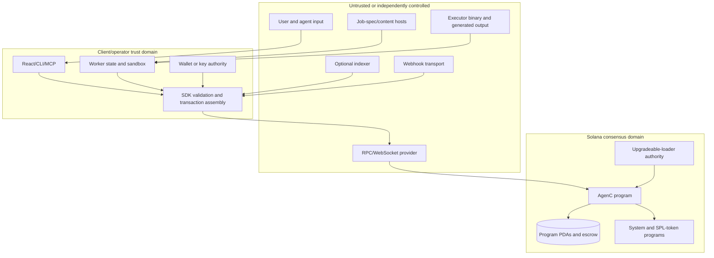

# Security boundaries

## Trust-zone map

## Boundary inventory

| Boundary | What crosses it | Primary controls | Residual dependency |
|---|---|---|---|
| Wallet → SDK | Transaction authority/signatures | Address-locked signer objects, explicit signing, versioned transaction construction | Wallet implementation and user consent |
| SDK → RPC | Account reads, simulation/send, subscriptions | Decoding, signature/result validation, bounded re-sign policy | RPC honesty for availability and preflight observations |
| RPC → program | Instructions and accounts | Anchor constraints, PDA seeds, owners, signers, versions, state machines | Solana runtime and deployed program identity |
| Program → system/token programs | Lamport and SPL-token movement | Checked arithmetic, program/mint/account binding, CPI constraints | Correct external program IDs and token semantics |
| Job host → worker | URI, redirects, DNS, JSON, prompt | Public-address-only resolution, redirect/size caps, canonical hash verification | Host availability and DNS/network infrastructure |
| Worker → executor | Prompt and environment | No shell, one argv prompt, private scratch dir, minimal env, output/time caps | Executable itself; platform isolation is not a VM |
| Executor/uploader → chain | Result artifact and URI | Durable intent, output checks, content hash, no submit after execution failure | Upload availability and result quality |
| Indexer → client | Aggregated reads/prepared data | Typed parsing and direct-chain alternatives where provided | Indexer freshness, completeness, and service policy |
| Webhook sender → SDK | Raw body, timestamp, signature | HMAC-SHA256 over exact raw bytes, full-scan comparison, bounded skew | Shared-secret custody and replay storage policy |
| MCP client → server | Tool name and JSON arguments | Schema validation, selected-tool allowlist, sanitized diagnostics | Host process permissions and MCP client policy |
| Operator → deployment rails | RPC, program, artifact, authority inputs | Plan-by-default, typed confirmations, hash/context/capacity checks | Upgrade-authority governance and operator machine |

## On-chain authorization and accounting

Anchor account constraints establish signer, mutability, owner, PDA, and relationship checks for statically declared accounts. Helpers repeat explicit checks for dynamically supplied accounts. The multisig path requires an M-of-N set from `remaining_accounts`; the proposer does not count unless also present as a supplied owner signer, signers must be system-owned, and the configured threshold is constrained to at least two and no more than the owner count.

Normal instructions enforce compatible protocol versions and reject pause state. Cleanup and exit operations use a separate compatibility check that permits recovery while paused without bypassing version ranges. Launch controls, authority rate limits, task permissions, attestor/resolver status, trust lists, and feature-specific gates add instruction-level policy.

Escrow settlement distinguishes lamports from SPL-token rewards. Completion validates dependency and validation prerequisites, accepted-bid account ordering, token program and mint, fee/reward legs, completion bonds, and referrer/collaborator destinations. Arithmetic uses checked operations, and the release profile retains overflow checks. Closing helpers validate ownership/writability and transfer lamports with checked arithmetic before zeroing data.

Program upgradeability remains a higher authority than instruction-level governance. The repository supplies guarded deployment scripts, but it does not implement or prove the external custody/governance of the upgrade key.

## Client and signing boundary

The SDK stabilizes signer objects at the expected address so a caller cannot substitute a signer/address pair during facade canonicalization. It builds v0 transactions with compute-budget instructions and rejects serialized transactions above Solana's 1,232-byte limit. Custom send transports must return a consistent signature/log result.

Retry policy distinguishes a proven pre-broadcast blockhash failure from ambiguous submission failure. Only the former permits rebuilding and re-signing. After a potentially successful broadcast, reconciliation stays tied to the locally derivable signature, avoiding accidental duplicate intent.

React exposes wallet bridges but does not embed production private keys. A local-key mock lives only under the testing export. MCP contains no signing key and never broadcasts prepared mutation transactions.

## Worker and untrusted execution

The worker treats task-controlled URIs, DNS, redirects, JSON, prompts, executor output, and uploader results as untrusted. Public-IP enforcement covers every DNS answer rather than choosing a convenient public answer from a mixed set. Each redirect is revalidated. Credentials in URLs, private/reserved ranges, overlarge bodies, excess redirects, noncanonical hashes, and oversize prompts fail closed before claiming/execution.

Safe executor mode reduces ambient authority with a new 0700 directory, private home, minimal environment, absolute path requirements, `shell: false`, process-group termination, and byte caps. It is process hygiene, not a complete sandbox: the selected binary retains the OS permissions of the worker account and may access network or resources allowed by the host unless an outer sandbox constrains it. Unsafe mode explicitly inherits more context.

State integrity uses a private directory/file, schema and size validation, exclusive locking, write-ahead intents, `fsync`, and atomic replacement. This supports crash recovery but cannot make RPC, content upload, or an external process atomic with local disk.

## Content, delivery, and webhook boundaries

Hash commitments bind job specs, task-thread entries, moderation payloads, and delivered plaintext to on-chain or signed references. Canonicalization rules are protocol data and must match across implementations. No Unicode normalization is performed for job specs, so visually similar strings may hash differently by design.

Delivery encryption uses X25519-derived key wrapping, HKDF, and AES-256-GCM. Manifest v2 authenticates metadata as AAD. The source explicitly treats an on-chain recipient-key commitment as a future design layer rather than an implemented guarantee; host availability and key release remain external trust dependencies.

Webhook verification accepts versioned HMAC-SHA256 signatures over the exact raw request body and a timestamp, with a five-minute default tolerance and a 24-hour maximum configured tolerance. Consumers still need secret rotation and application-level replay/idempotency policy.

## MCP protocol isolation

The MCP server reserves stdout for protocol frames and sends sanitized errors to stderr so logging cannot corrupt framing or leak full credential-bearing URLs. Read-only tools are the default. Mutation tools must be explicitly enabled and only prepare unsigned transactions; signature review and broadcast stay outside the server.

## Build and supply-chain controls

CI checks formatting, clippy/tests across feature combinations, fuzz targets, artifact and IDL drift, minimum toolchains, npm package graphs, generated-file freshness, reproducible SBF hashes, coverage ratchets, dependency audits, CodeQL, and secret scanning. Releases stage interdependent packages and apply distribution tags only after validation. Mainnet scripts refuse private-ZK production deployment and default to read-only plans.

These are repository controls, not proof that every external release, registry, RPC endpoint, or authority was operated correctly.

## Analysis limits and open risks

- GitNexus reported no taint findings because the index was not built with the PDG/taint layer; this is not a clean security result.
- The repository contains clients/contracts for hosted indexer, content, moderation, and upload services, but not their server implementations or operating controls.
- Anchor macro dispatch, feature gates, callbacks, subprocesses, and dynamic tool registries are only partially represented in the static call graph.
- No formal verification artifact was found. Tests, fuzzing, typed interfaces, and runtime checks do not substitute for formal proofs.
- Private-ZK code is feature-gated and release-quarantined; its presence in source does not imply deployment or production support.
- Deployment authority custody and live cluster state are outside this source-only analysis.
